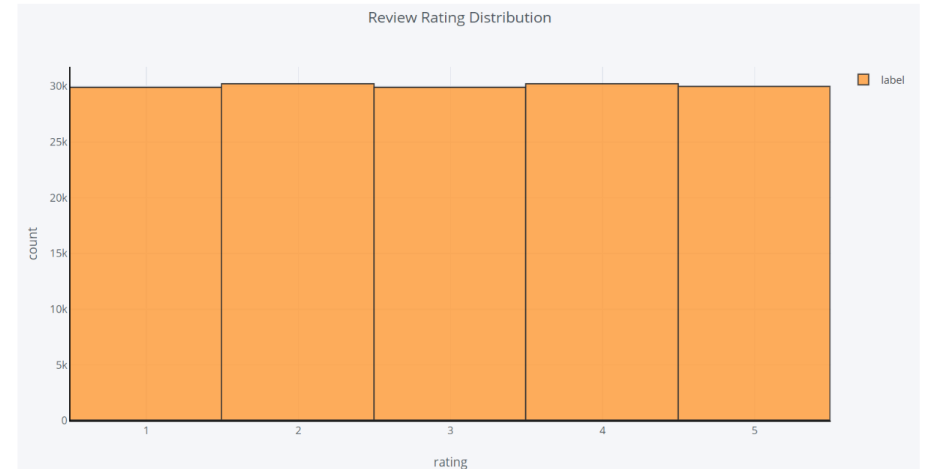
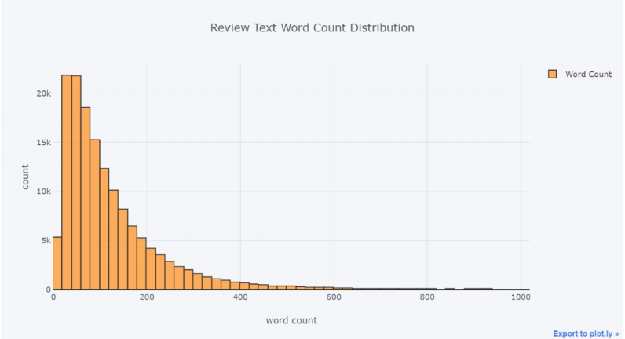
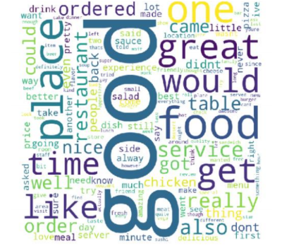
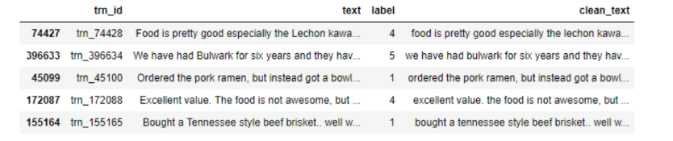
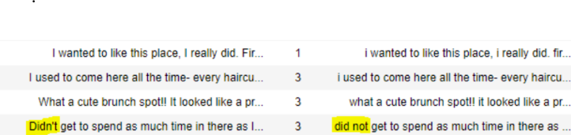
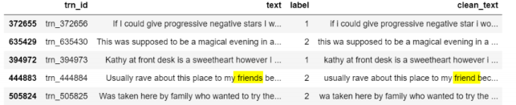

## Data Cleaning,Exploration and Sentiment Analysis.

1. The labelled data consists of 650000 food reviews.
2. The reviews has been explored properly using Exploratory Data Analysis.
3. Pre-Processing of the text has been performed to get the feature set for the modelling purpose.
4. The models used for the text classification are :
    * Linear Support Vector Machine.
    * Multinomial Naive Bayes.
    * Logistic Regression.
5. Multinomial Logistic Regression gave the highest accuracy with 63 %.

Image's of the Exploratory Data Analysis and important Pre-Processing.

1. **The histogram shows the rating distribution of the training data.**

 

2. **Word count distribution in each text document.**

 

3. **Word Cloud of the positive Word used for the review.**

 

4. **Case normalisation of the data.**

 
5. **Removal of Apostrophes and by checking their significance through Concordance.**

 
4. **Lemmatization of the data.**

